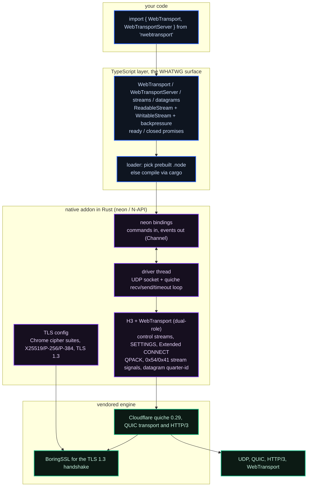

<div align="center">

# rwebtransport

### WebTransport for Node.js. The real thing.

#### A fully-compatible [WebTransport](https://developer.mozilla.org/en-US/docs/Web/API/WebTransport) client **and** server for Node.js: the browser API, backed by Cloudflare **quiche** and **BoringSSL**, bound to Node through **neon**.

<br/>

**⚡ Native QUIC/HTTP-3.** Cloudflare's `quiche` transport, the engine that serves a large slice of the internet, linked straight into your Node process.

**⚡ The standard API.** The same `WebTransport` class you use in Chrome: bidirectional and unidirectional streams as WHATWG streams, plus unreliable datagrams, over one multiplexed QUIC connection. And a matching server.

<br/>

[](https://www.npmjs.com/package/rwebtransport)
[](https://github.com/dacely-cloud/rwebtransport/actions/workflows/ci.yml)
[](#requirements)
[](https://www.typescriptlang.org/)
[](https://github.com/cloudflare/quiche)
[](https://boringssl.googlesource.com/boringssl/)
[](./LICENSE)

<br/>


</div>

---

<details>
<summary><b>Table of contents</b></summary>
<br/>

1. [Why](#why)
2. [Install](#install)
3. [Quick start](#quick-start)
4. [Reliable streams and unreliable datagrams](#reliable-streams-and-unreliable-datagrams)
5. [The client API](#the-client-api)
    - [Connecting](#connecting)
    - [Bidirectional streams](#bidirectional-streams)
    - [Unidirectional streams](#unidirectional-streams)
    - [Datagrams](#datagrams)
    - [Closing](#closing)
6. [The server API](#the-server-api)
7. [Threading, workers, and cluster](#threading-workers-and-cluster)
8. [Docs and examples](#docs-and-examples)
9. [Requirements](#requirements)
10. [How it works](#how-it-works)
11. [Building from source](#building-from-source)
12. [Testing](#testing)
13. [Robustness](#robustness)
14. [Security and the TLS profile](#security-and-the-tls-profile)
15. [License](#license)

</details>

---

**WebTransport is the modern transport for realtime apps:** lower latency than WebSocket, multiple independent streams over one connection with no head-of-line blocking, and unreliable datagrams for the data you would rather drop than delay. Browsers have shipped it for years. Node.js has not.

`rwebtransport` closes that gap. It is not an emulation over HTTP/2 or a WebSocket shim. It is a genuine HTTP/3 endpoint speaking QUIC over UDP, built on the same [Cloudflare quiche](https://github.com/cloudflare/quiche) engine that powers WebTransport at scale, exposed through the exact `WebTransport` API you already know from the browser, plus a matching `WebTransportServer`.

QUIC + HTTP/3 + WebTransport, implemented natively in Rust. It ships with prebuilt binaries. No round-trips through a browser, no polyfills, no HTTP/2 emulation, just an actual HTTP/3 datagram on the wire. And it provides the full standard surface: `WebTransport`, `WebTransportBidirectionalStream`, `WebTransportSendStream` and `WebTransportReceiveStream` as WHATWG streams, and `WebTransportDatagramDuplexStream`, all matching the [W3C spec](https://w3c.github.io/webtransport/).

By default the client also puts **Chrome on the wire**: the TLS profile advertises Google Chrome's cipher suites, curve preferences, and signature algorithms, so your handshake looks like a browser's. See [Security and the TLS profile](#security-and-the-tls-profile).

```bash
npm install rwebtransport
```

```ts
import { WebTransport } from 'rwebtransport';

const wt = new WebTransport('https://example.com:4433/echo');
await wt.ready;

const stream = await wt.createBidirectionalStream();
const writer = stream.writable.getWriter();
await writer.write(new TextEncoder().encode('hello over QUIC'));
await writer.close();

const { value } = await stream.readable.getReader().read();
console.log(new TextDecoder().decode(value)); // "hello over QUIC"
```

---

## Why

|                       | WebSocket          | `rwebtransport`             |
| --------------------- | ------------------ | --------------------------- |
| Transport             | TCP + TLS          | **QUIC** (UDP + TLS 1.3)    |
| Head-of-line blocking | Yes, one stream    | **No**, independent streams |
| Multiple streams      | One per connection | **Many**, multiplexed       |
| Unreliable messages   | ✗                  | **Datagrams** ✓             |
| Client and server     | ✗ (server only)    | **Both**, one package       |
| Browser-identical API | ✗                  | **✓ WHATWG `WebTransport`** |

If you are building game netcode, live media, collaborative editing, financial tick feeds, or anything where a stalled TCP segment must not freeze every other message, this is the transport you want, and now you can share client code between the browser and Node.

---

## Install

```bash
npm install rwebtransport
# or
pnpm add rwebtransport
# or
yarn add rwebtransport
```

Prebuilt native binaries are shipped for **Node 24 and Node 26** on **Linux, macOS, and Windows** (x64 and arm64). If a matching prebuilt binary is not found for your platform, the package **compiles the Rust core automatically** at install time. That needs a [Rust toolchain](https://rustup.rs), `cmake`, and a C/C++ compiler (BoringSSL is built from source). See [Building from source](#building-from-source).

---

## Quick start

```ts
import { WebTransport } from 'rwebtransport';

// 1. Open a session (QUIC handshake plus HTTP/3 Extended CONNECT).
const wt = new WebTransport('https://localhost:4433/chat', {
    // Trust a specific self-signed cert by its SHA-256, exactly like the browser API:
    serverCertificateHashes: [{ algorithm: 'sha-256', value: certHashBytes }],
});
await wt.ready;

// 2. Send an unreliable datagram.
const dgramWriter = wt.datagrams.writable.getWriter();
await dgramWriter.write(new Uint8Array([1, 2, 3]));

// 3. Accept streams the server opens.
const reader = wt.incomingUnidirectionalStreams.getReader();
const { value: receive } = await reader.read();
if (receive) {
    const { value: bytes } = await receive.getReader().read();
    console.log('server pushed', bytes?.length ?? 0, 'bytes');
}

// 4. Close.
wt.close({ closeCode: 0, reason: 'bye' });
```

Runnable versions of these live in [`examples/`](./examples).

---

## Reliable streams and unreliable datagrams

Yes, both, over the one QUIC connection, and this library implements each:

- **Streams are reliable and ordered.** A bidirectional stream (or a one-way send / receive stream) is a WHATWG `ReadableStream` / `WritableStream` of bytes. Everything you write is delivered, in order, with end-to-end backpressure onto QUIC flow control. Open as many as you want; they are independently multiplexed, so a stall on one never blocks another (no head-of-line blocking).
- **Datagrams are unreliable and unordered.** `session.datagrams` is a duplex of `Uint8Array` messages. Each datagram is sent best-effort in a single QUIC packet: it may be dropped, reordered, or never arrive, and it is never retransmitted. Reach for them when you would rather drop data than delay it: position updates, audio frames, heartbeats.

The complete TypeScript program below starts a server, connects a client, and exercises both. It is the runnable [`examples/echo.ts`](./examples/echo.ts) (the in-repo copy imports the built output; in your own project the import is `from 'rwebtransport'`). On Node 24+ you can run it directly with `node examples/echo.ts`.

```ts
import { X509Certificate, createHash } from 'node:crypto';
import { readFileSync } from 'node:fs';
import { dirname, join } from 'node:path';
import { fileURLToPath } from 'node:url';

import { WebTransport, WebTransportServer, type WebTransportServerSession } from 'rwebtransport';

const HERE = dirname(fileURLToPath(import.meta.url));
const CERT = join(HERE, 'cert.pem');
const KEY = join(HERE, 'key.pem');

const encoder = new TextEncoder();
const decoder = new TextDecoder();
const sleep = (ms: number): Promise<void> => new Promise((r) => setTimeout(r, ms));

// SHA-256 of the certificate's DER encoding: exactly what serverCertificateHashes wants.
function certHash(path: string): Uint8Array {
    const der = new X509Certificate(readFileSync(path)).raw;
    return new Uint8Array(createHash('sha256').update(der).digest());
}

// Echo an accepted session: pipe every reliable stream and every datagram back.
function echo(session: WebTransportServerSession): void {
    void (async () => {
        const reader = session.incomingBidirectionalStreams.getReader();
        for (;;) {
            const { value: stream, done } = await reader.read();
            if (done) break;
            if (stream) void stream.readable.pipeTo(stream.writable).catch(() => {});
        }
    })();
    void session.datagrams.readable.pipeTo(session.datagrams.writable).catch(() => {});
}

// Read a reliable readable stream to end-of-stream and return all its bytes.
async function readAll(readable: ReadableStream<Uint8Array>): Promise<Uint8Array> {
    const reader = readable.getReader();
    const chunks: Uint8Array[] = [];
    let total = 0;
    for (;;) {
        const { value, done } = await reader.read();
        if (done) break;
        if (value) {
            chunks.push(value);
            total += value.length;
        }
    }
    const out = new Uint8Array(total);
    let offset = 0;
    for (const chunk of chunks) {
        out.set(chunk, offset);
        offset += chunk.length;
    }
    return out;
}

async function main(): Promise<void> {
    // Server: bind an OS-assigned loopback port and echo everything.
    const server = new WebTransportServer({ host: '127.0.0.1', port: 0, cert: CERT, key: KEY });
    await server.ready;
    void (async () => {
        const reader = server.incomingSessions.getReader();
        for (;;) {
            const { value: session, done } = await reader.read();
            if (done) break;
            if (session) echo(session);
        }
    })();

    const url = `https://127.0.0.1:${server.port}/echo`;
    console.log(`server listening at ${url}`);

    // Client: connect, trusting the server's pinned certificate.
    const client = new WebTransport(url, {
        serverCertificateHashes: [{ algorithm: 'sha-256', value: certHash(CERT) }],
    });
    await client.ready;
    console.log('client connected');

    // RELIABLE: a bidirectional stream. Delivery is guaranteed and ordered.
    const stream = await client.createBidirectionalStream();
    const writer = stream.writable.getWriter();
    await writer.write(encoder.encode('hello over a reliable stream'));
    await writer.close(); // ends our send side so the echo's read side sees `done`
    const reply = decoder.decode(await readAll(stream.readable));
    console.log(`reliable stream echo: ${JSON.stringify(reply)}`);

    // UNRELIABLE: a datagram. Best-effort: it may be dropped, so we retry.
    const dgWriter = client.datagrams.writable.getWriter();
    const dgReader = client.datagrams.readable.getReader();
    const payload = encoder.encode('hello over an unreliable datagram');
    const inbound = dgReader.read().then((r) => r.value);
    let echoed: Uint8Array | undefined;
    for (let attempt = 0; attempt < 40 && !echoed; attempt++) {
        await dgWriter.write(payload);
        echoed = await Promise.race([inbound, sleep(25).then(() => undefined)]);
    }
    if (echoed) {
        console.log(`unreliable datagram echo: ${JSON.stringify(decoder.decode(echoed))}`);
    } else {
        console.log('unreliable datagram echo: none (datagrams are lossy by design)');
    }

    // Clean shutdown of both ends.
    client.close({ closeCode: 0, reason: 'done' });
    server.close();
    process.exit(0);
}

main().catch((err: unknown) => {
    console.error('echo failed:', err);
    process.exit(1);
});
```

Running it prints:

```text
server listening at https://127.0.0.1:53348/echo
client connected
reliable stream echo: "hello over a reliable stream"
unreliable datagram echo: "hello over an unreliable datagram"
```

---

## The client API

`rwebtransport` implements the [W3C WebTransport](https://w3c.github.io/webtransport/) interface. If you have used it in a browser, you already know this library.

### Connecting

```ts
const wt = new WebTransport(url, options?);
await wt.ready;   // resolves when the session is established, rejects if it fails
await wt.closed;  // resolves when the session ends cleanly, rejects on abnormal close
```

| Option                                                   | Type                                              | Meaning                                                                                                                                                   |
| -------------------------------------------------------- | ------------------------------------------------- | --------------------------------------------------------------------------------------------------------------------------------------------------------- |
| `serverCertificateHashes`                                | `{ algorithm: 'sha-256', value: BufferSource }[]` | Accept a server cert by its SHA-256 fingerprint (self-signed or pinned). Bypasses CA and hostname checks for the matching cert, exactly like the browser. |
| `insecure`                                               | `boolean`                                         | Node extension. Disable **all** certificate verification. Development only.                                                                               |
| `headers`                                                | `Record<string, string>`                          | Node extension. Extra request headers on the Extended CONNECT.                                                                                            |
| `origin`                                                 | `string`                                          | Node extension. Value for the `Origin` request header.                                                                                                    |
| `allowPooling`, `requireUnreliable`, `congestionControl` |                                                   | Accepted for spec parity; currently informational.                                                                                                        |

When neither `serverCertificateHashes` nor `insecure` is set, the client performs full PKI validation against the system trust store with hostname checking.

### Bidirectional streams

```ts
const stream = await wt.createBidirectionalStream();
// stream.readable : WebTransportReceiveStream (a ReadableStream<Uint8Array>)
// stream.writable : WebTransportSendStream    (a WritableStream<Uint8Array>)

// Streams the peer opens:
const reader = wt.incomingBidirectionalStreams.getReader();
const { value: peerStream } = await reader.read();
```

### Unidirectional streams

```ts
const send = await wt.createUnidirectionalStream(); // a WritableStream<Uint8Array>
const writer = send.getWriter();
await writer.write(payload);
await writer.close();
```

### Datagrams

```ts
const writer = wt.datagrams.writable.getWriter();
await writer.write(new Uint8Array([0xde, 0xad]));

const reader = wt.datagrams.readable.getReader();
const { value } = await reader.read(); // Uint8Array or undefined

wt.datagrams.maxDatagramSize; // largest payload that fits in one packet
```

### Closing

```ts
wt.close({ closeCode: 0, reason: 'done' });
await wt.closed;
```

---

## The server API

The same package ships a **WebTransport server**. Bind a UDP port with a certificate, then consume `incomingSessions`. Each is a `WebTransportServerSession` with the exact same stream and datagram surface as the client `WebTransport`.

```ts
import { WebTransportServer } from 'rwebtransport';

const server = new WebTransportServer({
    port: 4433,
    host: '0.0.0.0',
    cert: '/path/to/cert.pem', // PEM certificate chain (file path)
    key: '/path/to/key.pem', // PEM private key (file path)
});
await server.ready;
console.log('listening on', server.port);

const reader = server.incomingSessions.getReader();
for (;;) {
    const { value: session, done } = await reader.read();
    if (done) break;

    console.log('new session:', session.path, session.authority);

    // Echo every bidirectional stream straight back:
    const streams = session.incomingBidirectionalStreams.getReader();
    void (async () => {
        for (;;) {
            const { value: stream, done } = await streams.read();
            if (done) break;
            void stream.readable.pipeTo(stream.writable);
        }
    })();

    // Open a stream or send a datagram from the server side:
    const outbound = await session.createUnidirectionalStream();
    await outbound.getWriter().write(new TextEncoder().encode('welcome'));
}
```

`WebTransportServerSession` exposes `ready`, `closed`, `datagrams`, `createBidirectionalStream()`, `createUnidirectionalStream()`, `incomingBidirectionalStreams`, `incomingUnidirectionalStreams`, and `close()`, identical to the client, plus the request metadata (`authority`, `path`, `origin`, `headers`). The server runs on the same quiche engine and inherits the same panic containment and hostile-peer hardening as the client.

---

## Threading, workers, and cluster

- **Threading.** Each session runs its QUIC/HTTP-3 work on its own background thread and talks to the JS event loop through neon's `Channel`. Every hand-off is non-blocking (an unbounded command channel, a non-blocking event channel, atomics), so the library never deadlocks internally; it only ever applies backpressure. The one way to wedge a stream is the universal one: writing a large bidirectional stream without concurrently reading it. Read while you write.
- **`worker_threads`.** Fully supported. The addon is context-aware, so a client or server can be created inside any Worker and each Worker gets its own instance bound to its own event loop. Multiple Workers run concurrently.
- **`cluster`.** Clients work as-is (each process is independent). A server can share one listening port across cluster workers with `reusePort: true` (`SO_REUSEPORT`, Unix only); the kernel load-balances connections across the workers. On Windows, run one server per port or put a UDP load balancer in front.

---

## Docs and examples

- **[`docs/`](./docs)** is the full guide: getting started, the client and server APIs in depth, streams and backpressure, datagrams, certificates and TLS, error handling, threading, building, and troubleshooting.
- **[`examples/`](./examples)** has runnable client and server programs and a one-file end-to-end demo.

---

## Requirements

- **Node.js 24.x or 26.x.** No other versions are supported; the native ABI is built and tested against exactly these.
- **Linux, macOS, or Windows** (x64 or arm64).
- To build from source: **Rust** (stable), **cmake**, and a **C/C++ toolchain** (plus **NASM** on Windows) for BoringSSL.

---

## How it works



1. **The TypeScript layer** presents the browser `WebTransport` API (and `WebTransportServer`) and maps it onto WHATWG `ReadableStream`/`WritableStream`, wiring up backpressure both ways.
2. **The neon binding** turns JS calls into commands for a dedicated **driver thread** and delivers asynchronous events (stream data, datagrams, session state) back to the event loop.
3. **The driver thread** owns a UDP socket and runs the **quiche** connection: reading packets, writing packets, arming timers.
4. **The H3/WebTransport layer**, since quiche does not itself speak WebTransport, implements the HTTP/3 control streams, the `SETTINGS` exchange, QPACK-encoded **Extended CONNECT** (sent by the client, answered by the server), the `0x54`/`0x41` stream signals, and the RFC 9297 quarter-stream-id datagram framing, all on top of quiche's raw QUIC streams. The state machine is dual-role, so client and server share one hardened implementation.
5. **BoringSSL**, configured with a Chrome-like TLS profile, performs the TLS 1.3 handshake inside QUIC.

---

## Building from source

```bash
git clone https://github.com/dacely-cloud/rwebtransport
cd rwebtransport
npm install
npm run build         # cargo build, copy .node, bundle TS
```

The native crates live in `crates/`, the QUIC engine is vendored under `vendor/quiche`, and the compiled addon is written to `prebuilds/<platform>-<arch>/rwebtransport.node`.

```bash
npm run build:rust        # release build of the native addon
npm run build:rust:debug  # faster debug build
npm run build:ts          # bundle the TypeScript layer
```

Building from source needs a Rust toolchain, cmake, a C/C++ compiler, and Go (BoringSSL is compiled from source). Helper scripts install the toolchain for you, one per platform family:

```bash
npm run setup:unix        # Linux/macOS: compiler, cmake, ninja, Go, Rust via your package manager
```

```powershell
npm run setup:windows     # Windows: Rust, CMake, Go, NASM via winget, and sets ASM_NASM
```

On **Windows** you also need NASM (BoringSSL's assembler). If a `cargo build` there fails with `Could not find the compiler specified in the environment variable ASM_NASM`, that is the missing NASM; run the script above (or see [`docs/building.md`](./docs/building.md#windows-setup)) and rebuild in a fresh terminal.

---

## Testing

End-to-end tests run the real client and the real server against each other and against a dedicated quiche echo-server fixture. No mocks.

```bash
npm test
```

The suite covers the QUIC handshake, Extended CONNECT, bidirectional and unidirectional streams, datagrams, backpressure, and graceful and error close paths. It also includes:

- an **adversarial suite** that points a real client at a deliberately hostile server (rejected CONNECT, malformed QPACK, garbage frames, stream resets, mid-session close) and a careless caller (operations after close, oversized datagrams);
- **server** tests where our own client drives our own server (bidi echo, large payloads, unidirectional echo, datagrams, concurrent sessions);
- **`worker_threads`** tests (a client running inside a Worker, multiple Workers concurrently) and a **deadlock-freedom** test (a payload larger than every flow-control window echoed with concurrent read and write).

---

## Robustness

The native core treats the peer and the caller as untrusted, on both the client and the server:

- **A panic can never crash Node.** The entire driver thread runs inside a panic boundary; a panic (or a fatal setup error) is surfaced as an `error` event that rejects `ready`/`closed`. It never aborts the process and never silently hangs the session.
- **Bounded memory under flood.** A hostile peer cannot grow memory without limit: event delivery to the JS loop is backpressured (unread stream data stays flow-controlled in QUIC, excess datagrams are dropped), the datagram queue is bounded, HTTP/3 frame buffers are capped, and finished streams are pruned.
- **No blocking on the event loop.** DNS resolution, the socket bind, and the QUIC handshake all run on the driver thread, so the constructor never blocks Node.
- **Hostile input is fail-closed.** Malformed HTTP/3, bad QPACK, oversized frames, unexpected resets, and out-of-range numbers from JS are handled by rejecting or closing cleanly rather than panicking.

---

## Security and the TLS profile

By default the client advertises the **Google Chrome** TLS profile: Chrome's cipher-suite order, the `X25519 / P-256 / P-384` group preference, and Chrome's signature-algorithm list, negotiated as **TLS 1.3 only** (as QUIC requires). This makes the handshake indistinguishable from a browser's and maximizes compatibility with servers (including Cloudflare) that key behavior off the TLS ClientHello.

Certificate verification follows the WebTransport model: full PKI validation by default, or explicit trust of a server certificate by its `sha-256` hash via `serverCertificateHashes`, exactly like the browser API. The `insecure` option disables verification entirely and is intended for development only.

---

## License

[Apache-2.0](./LICENSE). Vendored components (Cloudflare quiche, BoringSSL, neon) remain under their own licenses. See [NOTICE](./NOTICE).

<div align="center">
<sub>Built by <a href="https://github.com/dacely-cloud">Dacely Cloud</a>.</sub>
</div>
