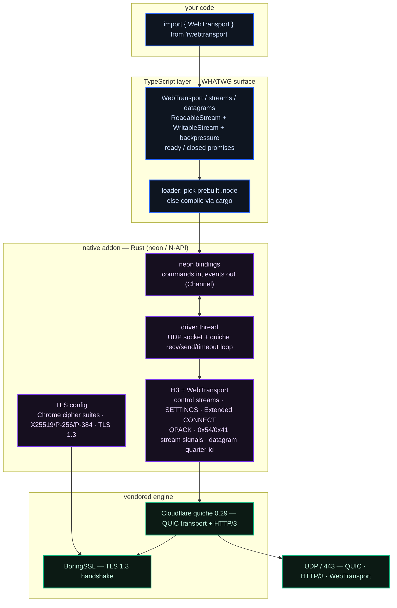

<div align="center">

# rwebtransport

### WebTransport for Node.js. The real thing.

#### A fully-compatible [WebTransport](https://developer.mozilla.org/en-US/docs/Web/API/WebTransport) client **and server** for Node.js — the browser API, backed by Cloudflare **quiche** and **BoringSSL**, bound to Node through **neon**.

<br/>

**⚡ Native QUIC/HTTP-3.** Cloudflare's `quiche` transport, the engine that serves a large slice of the internet, linked straight into your Node process.

**⚡ The standard API.** The same `WebTransport` class you use in Chrome — bidirectional and unidirectional streams as WHATWG streams, plus unreliable datagrams, over one multiplexed QUIC connection.

<br/>

[](https://www.npmjs.com/package/rwebtransport)
[](https://github.com/dacely-cloud/rwebtransport/actions/workflows/ci.yml)
[](#requirements)
[](https://www.typescriptlang.org/)
[](https://github.com/cloudflare/quiche)
[](https://boringssl.googlesource.com/boringssl/)
[](./LICENSE)

<br/>


</div>

---

<details>
<summary><b>Table of contents</b></summary>
<br/>

1. [Why](#why)
2. [Install](#install)
3. [Quick start](#quick-start)
4. [The API](#the-api)
   - [Connecting](#connecting)
   - [Bidirectional streams](#bidirectional-streams)
   - [Unidirectional streams](#unidirectional-streams)
   - [Datagrams](#datagrams)
   - [Closing](#closing)
5. [Server](#server)
6. [Requirements](#requirements)
6. [How it works](#how-it-works)
7. [Building from source](#building-from-source)
8. [Testing](#testing)
9. [Robustness](#robustness)
10. [Security &amp; the TLS profile](#security--the-tls-profile)
11. [License](#license)

</details>

---

**WebTransport is the modern transport for realtime apps** — lower latency than WebSocket, multiple independent streams over one connection with no head-of-line blocking, and unreliable datagrams for the data you would rather drop than delay. Browsers have shipped it for years. Node.js has not.

`rwebtransport` closes that gap. It is not an emulation over HTTP/2 or a WebSocket shim — it is a genuine HTTP/3 client speaking QUIC on UDP/443, built on the same [Cloudflare quiche](https://github.com/cloudflare/quiche) engine that powers WebTransport at scale, exposed through the exact `WebTransport` API you already know from the browser.

QUIC + HTTP/3 + WebTransport, implemented natively in Rust. It ships with prebuilt binaries — no QUIC server round-trips through a browser, no polyfills, no HTTP/2 emulation, just an actual HTTP/3 datagram on the wire. And it provides the full standard surface: `WebTransport`, `WebTransportBidirectionalStream`, `WebTransportSendStream` / `ReceiveStream` as WHATWG streams, and `WebTransportDatagramDuplexStream`, all matching the [W3C spec](https://w3c.github.io/webtransport/).

By default the client also puts **Chrome on the wire**: the TLS profile advertises Google Chrome's cipher suites, curve preferences, and signature algorithms, so your handshake looks like a browser's — see [Security &amp; the TLS profile](#security--the-tls-profile).

```bash
npm install rwebtransport
```

```ts
import { WebTransport } from 'rwebtransport';

const wt = new WebTransport('https://example.com:4433/echo');
await wt.ready;

const stream = await wt.createBidirectionalStream();
const writer = stream.writable.getWriter();
await writer.write(new TextEncoder().encode('hello over QUIC'));
await writer.close();

const { value } = await stream.readable.getReader().read();
console.log(new TextDecoder().decode(value)); // -> "hello over QUIC"
```

---

## Why

| | WebSocket | `rwebtransport` |
|---|---|---|
| Transport | TCP + TLS | **QUIC** (UDP + TLS 1.3) |
| Head-of-line blocking | Yes, one stream | **No**, independent streams |
| Multiple streams | One per connection | **Many**, multiplexed |
| Unreliable messages | ✗ | **Datagrams** ✓ |
| 0-RTT / fast reconnect | ✗ | On the roadmap |
| Browser-identical API | ✗ | **✓ WHATWG `WebTransport`** |

If you are building game netcode, live media, collaborative editing, financial tick feeds, or anything where a stalled TCP segment must not freeze every other message, this is the transport you want — and now you can share client code between the browser and the server.

---

## Install

```bash
npm install rwebtransport
# or
pnpm add rwebtransport
# or
yarn add rwebtransport
```

Prebuilt native binaries are shipped for **Node 24 and Node 26** on **Linux, macOS, and Windows** (x64 + arm64). If a matching prebuilt binary is not found for your platform, the package **compiles the Rust core automatically** at install time — this needs a [Rust toolchain](https://rustup.rs), `cmake`, and a C/C++ compiler (BoringSSL is built from source). See [Building from source](#building-from-source).

---

## Quick start

```ts
import { WebTransport } from 'rwebtransport';

// 1. Open a session (QUIC handshake + HTTP/3 Extended CONNECT).
const wt = new WebTransport('https://localhost:4433/chat', {
  // Trust a specific self-signed cert by its SHA-256, exactly like the browser API:
  serverCertificateHashes: [{ algorithm: 'sha-256', value: certHashBytes }],
});
await wt.ready;

// 2. Send an unreliable datagram.
const dgramWriter = wt.datagrams.writable.getWriter();
await dgramWriter.write(new Uint8Array([1, 2, 3]));

// 3. Accept streams the server opens.
for await (const receive of readable(wt.incomingUnidirectionalStreams)) {
  const bytes = await drain(receive);
  console.log('server pushed', bytes.length, 'bytes');
}

// 4. Close.
wt.close({ closeCode: 0, reason: 'bye' });
```

---

## The API

`rwebtransport` implements the [W3C WebTransport](https://w3c.github.io/webtransport/) interface. If you have used it in a browser, you already know this library.

### Connecting

```ts
const wt = new WebTransport(url, options?);
await wt.ready;                 // resolves when the session is established
await wt.closed;                // resolves/rejects when the session ends
```

| Option | Type | Meaning |
|---|---|---|
| `serverCertificateHashes` | `{ algorithm: 'sha-256', value: BufferSource }[]` | Accept a server cert by hash (self-signed / pinned). |
| `allowPooling` | `boolean` | Allow reusing a pooled QUIC connection. |
| `congestionControl` | `'default' \| 'throughput' \| 'low-latency'` | Hint for the congestion controller. |
| `requireUnreliable` | `boolean` | Fail if datagrams are unavailable. |

### Bidirectional streams

```ts
const stream = await wt.createBidirectionalStream();
// stream.readable  : WebTransportReceiveStream (ReadableStream<Uint8Array>)
// stream.writable  : WebTransportSendStream    (WritableStream<Uint8Array>)

for await (const stream of readable(wt.incomingBidirectionalStreams)) {
  // handle a stream the peer opened
}
```

### Unidirectional streams

```ts
const send = await wt.createUnidirectionalStream(); // WritableStream<Uint8Array>
const writer = send.getWriter();
await writer.write(payload);
await writer.close();
```

### Datagrams

```ts
const writer = wt.datagrams.writable.getWriter();
await writer.write(new Uint8Array([0xde, 0xad]));

const reader = wt.datagrams.readable.getReader();
const { value } = await reader.read(); // Uint8Array | undefined

wt.datagrams.maxDatagramSize; // largest payload that will fit in one packet
```

### Closing

```ts
wt.close({ closeCode: 0, reason: 'done' });
await wt.closed;
```

---

## Server

The same package ships a **WebTransport server**. Bind a UDP port with a certificate, then consume `incomingSessions` — each is a `WebTransportServerSession` with the exact same stream and datagram surface as the client `WebTransport`.

```ts
import { WebTransportServer } from 'rwebtransport';

const server = new WebTransportServer({
  port: 4433,
  host: '0.0.0.0',
  cert: '/path/to/cert.pem', // PEM certificate chain
  key: '/path/to/key.pem', // PEM private key
});
await server.ready;
console.log('listening on', server.port);

const reader = server.incomingSessions.getReader();
for (;;) {
  const { value: session, done } = await reader.read();
  if (done) break;

  console.log('new session:', session.path, session.authority);

  // Echo every bidirectional stream straight back:
  const streams = session.incomingBidirectionalStreams.getReader();
  void (async () => {
    for (;;) {
      const { value: stream, done } = await streams.read();
      if (done) break;
      void stream.readable.pipeTo(stream.writable);
    }
  })();

  // Open a stream / send a datagram from the server side:
  const outbound = await session.createUnidirectionalStream();
  await outbound.getWriter().write(new TextEncoder().encode('welcome'));
}
```

`WebTransportServerSession` exposes `ready`, `closed`, `datagrams`, `createBidirectionalStream()`, `createUnidirectionalStream()`, `incomingBidirectionalStreams`, `incomingUnidirectionalStreams`, and `close()` — identical to the client — plus the request metadata (`authority`, `path`, `origin`, `headers`). The server is powered by the same quiche engine and inherits the same panic containment and hostile-peer hardening as the client.

---

## Requirements

- **Node.js 24.x or 26.x.** No other versions are supported — the native ABI is built and tested against exactly these.
- **Linux, macOS, or Windows** (x64 or arm64).
- To build from source: **Rust** (stable), **cmake**, and a **C/C++ toolchain** (plus **NASM** on Windows) for BoringSSL.

---

## How it works



1. **The TypeScript layer** presents the exact browser `WebTransport` API and maps it onto WHATWG `ReadableStream`/`WritableStream`, wiring up backpressure both ways.
2. **The neon binding** turns JS calls into commands for a dedicated **driver thread** and delivers asynchronous events (stream data, datagrams, session state) back to the event loop.
3. **The driver thread** owns a UDP socket and runs the **quiche** connection: reading packets, writing packets, arming timers.
4. **The H3/WebTransport layer** — since quiche does not itself speak WebTransport — implements the HTTP/3 control streams, the `SETTINGS` exchange, QPACK-encoded **Extended CONNECT**, the `0x54`/`0x41` stream signals, and the RFC 9297 quarter-stream-id datagram framing, all on top of quiche's raw QUIC streams.
5. **BoringSSL**, configured with a Chrome-like TLS profile, performs the TLS 1.3 handshake inside QUIC.

---

## Building from source

```bash
git clone https://github.com/dacely-cloud/rwebtransport
cd rwebtransport
npm install
npm run build         # cargo build + copy .node + bundle TS
```

The native crate lives in `crates/native`, the QUIC engine is vendored under `vendor/quiche`, and the compiled addon is written to `prebuilds/<platform>-<arch>/rwebtransport.node`.

```bash
npm run build:rust        # release build of the native addon
npm run build:rust:debug  # faster debug build
npm run build:ts          # bundle the TypeScript layer
```

---

## Testing

End-to-end tests run the real client against a real WebTransport **echo server** (also built on quiche, in `crates/echo-server`) spawned by the test harness — no mocks.

```bash
npm test
```

The suite exercises the QUIC handshake, Extended CONNECT, bidirectional echo, unidirectional streams, datagrams, backpressure, and graceful/error close paths — plus an **adversarial suite** that points a real client at a deliberately hostile server (rejected CONNECT, malformed QPACK, garbage frames, stream resets, mid-session close) and a careless caller (operations after close, oversized datagrams). All of it runs against a real quiche server, no mocks.

---

## Robustness

The native core treats the server and the caller as untrusted:

- **A panic can never crash Node.** The entire driver thread runs inside a panic boundary; a panic (or a fatal setup error) is surfaced as an `error` event that rejects `ready`/`closed` — it never aborts the process and never silently hangs the session.
- **Bounded memory under flood.** A hostile server cannot grow memory without limit: event delivery to the JS loop is backpressured (unread stream data stays flow-controlled in QUIC, excess datagrams are dropped), the datagram queue is bounded, HTTP/3 frame buffers are capped, and finished streams are pruned.
- **No blocking on the event loop.** DNS resolution, the socket bind, and the QUIC handshake all run on the driver thread, so the constructor never blocks Node.
- **Hostile input is fail-closed.** Malformed HTTP/3, bad QPACK, oversized frames, unexpected resets, and out-of-range numbers from JS are handled by rejecting/closing cleanly rather than panicking.

---

## Security & the TLS profile

By default the client advertises the **Google Chrome** TLS profile: Chrome's cipher-suite order, the `X25519 / P-256 / P-384` group preference, and Chrome's signature-algorithm list, negotiated as **TLS 1.3 only** (as QUIC requires). This makes the handshake indistinguishable from a browser's and maximizes compatibility with servers — including Cloudflare — that key behavior off the TLS ClientHello.

Certificate verification follows the WebTransport model: full PKI validation by default, or explicit trust of a server certificate by its `sha-256` hash via `serverCertificateHashes`, exactly like the browser API. The `insecure` option disables verification entirely and is intended for development only.

---

## License

[Apache-2.0](./LICENSE). Vendored components (Cloudflare quiche, BoringSSL, neon) remain under their own licenses — see [NOTICE](./NOTICE).

<div align="center">
<sub>Built by <a href="https://github.com/dacely-cloud">Dacely Cloud</a>.</sub>
</div>
